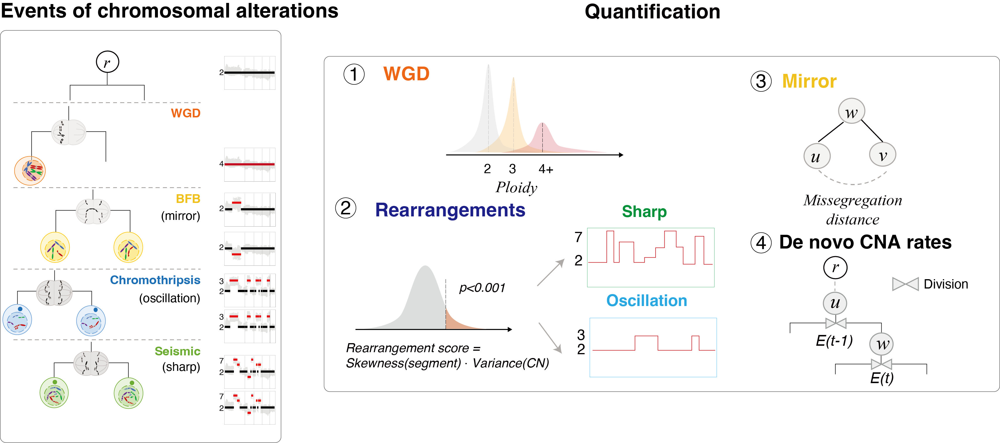

Description
===========


`ChromoPhyloGen` is a framework designed to characterize four copy number alteration (CNA) patterns at the single-cell level. It identifies CNA patterns associated with **de novo** CNA accumulation and lineage heterogeneity, providing insights into tumor evolution and cellular diversity.




# System Requirements and Dependencies

## Development Environment
- **Operating System**: macOS (recommended)
- **Python Version**: >=3  
  While the package was developed using Python 3.8.2.


In addition, `ChromoPhyloGen` will automatically install the following dependency packages during the installation process. 

`biopython`,`Cython`,`numpy`,`pandas`,`scikit-learn`,`scipy`,`tqdm`,`statsmodels`

## Dependencies
`ChromoPhyloGen` depends on the following Python libraries, which will be automatically installed during the package installation process:
- `biopython`
- `Cython`
- `numpy`
- `pandas`
- `scikit-learn`
- `scipy`
- `tqdm`
- `statsmodels`
> **Note**: It is recommended to pre-install the required dependencies in your environment to ensure compatibility and avoid potential installation issues.

---

# Installation

We recommend using a virtual environment to isolate the dependencies of `ChromoPhyloGen`. However, this step is optional.

## Step 1: Create and Activate a Virtual Environment
```bash
conda create --name ChromoPhyloGen_env python=3.8
conda activate ChromoPhyloGen_env
```
## Step 2: Clone the Repository and Install the Package
```bash
git clone https://github.com/FangWang-SYSU/ChromoPhyloGen.git
cd ChromoPhyloGen
pip install .
```
## Step 3: Verify Installation
```bash
ChromoPhyloGen --version
```

After the installation is complete, you can use the `ChromoPhyloGen --version`  command to test whether the software was successfully installed.

# Usage
`ChromoPhyloGen` provides command-line arguments to specify input files, output paths, and other configurations. Below is an overview of the available options:
```
optional arguments:
  -h, --help            show this help message and exit
  --version             show program's version number and exit
  -i CNV_DATA, --cnv_data CNV_DATA
                        All node CNA in newick.
  -o OUTPUT, --output OUTPUT
                        The output path.
  -t TREE, --tree TREE  Newick format file path.
  -p PREFIX, --prefix PREFIX
                        Prefix for output file names.
  -r RANDOM_NUM, --random_num RANDOM_NUM
                        Random number for creating a null distribution.
  -c CANCER_TYPE, --cancer_type CANCER_TYPE
                        Select a cancer type for estimating WGD. The default is all.
  -n NCORES, --ncores NCORES
                        Number of cores required to run copy number variation events.

Author: wangxin, Email: wangx768@mail2.sysu.edu.cn
```
## Example Command
```bash
ChromoPhyloGen [-h] [--version] -i CNV_DATA -o OUTPUT [-t TREE] [-p PREFIX] [-r RANDOM_NUM] [-c CANCER_TYPE] [-n NCORES]
```

# Input Files

## Requirements

The input file for **ChromoPhyloGen** must be an integer copy number spectrum with the following structure:

- Each row represents a genome segment.
- The first column specifies the chromosome.
- The second column specifies the starting coordinate of the genome segment.
- The third column specifies the ending coordinate of the genome segment.
- The subsequent columns represent the integer copy numbers for each cell.

**Example Input Format**:

  	chr	start	end	cell_1	cell_2	cell_3 ...
    1	100167143	100220943	2	2	2 ...
    1	100504443	100559237	2	1	2 ...
    1	101395562	101451560	2	3	4 ...

>Connection with [inferCNV](https://github.com/broadinstitute/inferCNV):
> 
> To generate the integer copy number spectrum, we suggest identifying peaks and inferring their intervals. Each interval corresponds to a distinct integer copy number. Detailed information about this method can be found in the methodology section of the **ChromoPhyloGen** documentation.

# Examples

## Run in Command Line

The example dataset, `exampleCNA.txt`, is included in the `ChromoPhyloGen` package and can also be downloaded [here](https://github.com/FangWang-SYSU/ChromoPhyloGen/blob/main/ChromoPhyloGen/data/exampleCNA.txt).

### Example 1: Without a Tree Newick File

In this example, no input tree in Newick format is provided (-t none). The tool will calculate metrics based on the input CNA data but will not update or output a phylogenetic tree.

```bash
mkdir ChromoPhyloGen_out
ChromoPhyloGen \
    -i ./ChromoPhyloGen/data/exampleCNA.txt \
    -o ./ChromoPhyloGen_out \
    -t none \
    -p example_ \
    -r 1 \
    -c ALL \
    -n 4
```
### Example 2: With a Tree Newick File

In this example, an input tree in Newick format is provided (-t ./ChromoPhyloGen/data/example_tree.newick). The tool will calculate additional metrics based on the input tree and CNA data, update the branch lengths of the tree, and output the updated tree as a new Newick file (cell_tree.newick).

```bash
mkdir ChromoPhyloGen_out_tree
ChromoPhyloGen \
    -i ./ChromoPhyloGen/data/exampleCNA.txt \
    -o ./ChromoPhyloGen_out_tree \
    -t ./ChromoPhyloGen/data/example_tree.newick \
    -p example_ \
    -r 1 \
    -c ALL \
    -n 4
```


# Output Files

The output files generated by **ChromoPhyloGen** are summarized below:

| ID  | File Name                | Description                                                   | Require Newick |
|:---:|:-------------------------|:-------------------------------------------------------------|:--------------:|
| 1   | *cell_info.txt           | Cell variation information in trace                          | Yes            |
| 2   | *all_node_data.txt       | Cell CNA profile, including internal nodes (named "virtual_")| Yes            |
| 3   | *cell_tree.newick        | Single cell trace file in Newick format                      | Yes            |
| 4   | *error_risk_score.txt    | Division error risk                                          | Yes            |
| 5   | *re_score.txt            | Chromosomal rearrangements score                             | No             |
| 6   | *re_score_pvalue.txt     | P-value of chromosomal rearrangements score                  | No             |
| 7   | *chromothripsis_score.txt| Chromosomal chromothripsis score                             | No             |
| 8   | *mode.txt                | Defines the mode for each cell                               | No             |

> **Note:** The `*` corresponds to the `-p` parameter, indicating the prefix for the output file names.
> If "Require Newick" is Yes, it means the corresponding output file depends on the Newick file. If it is No, the output does not depend on the Newick file.

---

## File Details

### 1. *cell_info.txt
Contains detailed information about cell variation in the evolutionary trace.

**Example Format**:

    name	Root_gain_loc	Root_loss_loc	Root_gain_cn	Root_loss_cn	Parent_gain_loc	Parent_loss_loc	Parent_gain_cn	Parent_loss_cn	Mitosis_copy	Mitosis_dd_loc	Mitosis_ad_loc	Mitosis_time	Pseudotime_tree	Mitosis_time_next	aneu_rate	copy_rate	status
    root										1042.0	163.0	20.0	0.0	40.0	0.013		Aneuploidy
    cell_2	160.0	428.0	428.0	160.0	160.0	428.0	160.0	428.0	11617.0	825.0	478.0	31.0	21.0	21.0	0.039	0.951	Aneuploidy
    cell_3	151.0	629.0	629.0	151.0	151.0	629.0	151.0	629.0	11425.0	1801.0	182.0	32.5	19.0	19.0	0.014	0.936	Aneuploidy
    cell_4	51.0	360.0	360.0	51.0	291.0	410.0	291.0	410.0	11504.0	779.0	189.0	25.0	46.0	25.0	0.015	0.942	Aneuploidy
**Field Descriptions**:
- **[Root|Parent]_[gain|loss]_[loc|cn]**: Number of sites or copies (gain/loss) relative to the root/parent node.
- **Mitosis_copy**: Count of genomic segments with identical copy number states between the current node and its parent (D_ss).
- **Mitosis_dd_loc**: Count of genomic segments with different copy number states between the current node and its parent (D_ds).
- **Mitosis_ad_loc**: Count of aneuploidy segregation states between the current node and its parent (D_as).
- **Mitosis_time**: Branch length of the current node.
- **Pseudotime_tree**: Pseudotime of the current node in the tree.
- **Mitosis_time_next**: Branch length of the next mitosis of the current node.
- **aneu_rate**: Rate of aneuploidy segregation states.
- **copy_rate**: Rate of identical copy number states.
- **status**: Mitotic state inferred based on `aneu_rate` and `copy_rate`.

---

### 2. *all_node_data.txt
Contains integer copy number profiles for all nodes in the tree.

**Example Format**:

    	1_977836_977836	1_1200863_1200863 ...
    cell1	1.0	1.0	...
    cell2	2.0	2.0	...
>Integer copy number profile of all nodes in tree. Rows are cells, columns are genome segments.
**Details**:
- Rows represent cells.
- Columns represent genome segments.

---

### 3. *cell_tree.newick
Stores the evolutionary tree structure in Newick format, including branch lengths.

---
### 4. *error_risk_score.txt
Contains the division error risk score for each cell.

**Example Format**:

    cell_1	0.24
    cell_2	0.19
    cell_3	0.87

**Details**:
- Column 1: Cell ID.
- Column 2: Error risk score.

---

### 5. *re_score.txt
Contains chromosomal rearrangement scores for each chromosome in each cell.

**Example Format**:

    ,1,2,3,...
    cell_1,0.761,0.800,0.793,...
    cell_2,0.88,0.0,0.636,0.659,...
    cell_3,0.88,0.957,0.783,...

**Details**:
- Rows represent cells.
- Columns represent chromosomes.
- A value of `-1` indicates no significant chromosomal change.

---

### 6. *re_score_pvalue.txt
P-values for chromosomal rearrangement scores. See the methodology section for details.

---

### 7. *chromothripsis_score.txt
Contains chromosomal chromothripsis scores for each chromosome in each cell.

**Example Format**:

    ,1,2,3,...
    cell_1,0.001,0.008,0.705,...
    cell_2,0.780,0.005,0.837,...
    cell_3,0.890,0.907,0.463,...
---

### 8. *mode.txt
Defines the mode for each cell.

**Example Format**:

    ,chr_num,wgd,chromothripsis_num,seismic_num,chromothripsis_score,seismic_score,BFB
    cell_1,19,WGD1,14,5,0.009,0.0149,1368
    cell_2,11,WGD1,7,4,0.001,0.006,234
    cell_3,12,WGD0,6,6,0.002,0.001,209

**Field Descriptions**:
- **chr_num**: Total chromosomes involved in chromothripsis and seismic events.
- **wgd**: Whole genome duplication (WGD) type (`WGD0`, `WGD1`, `WGD2`).
- **chromothripsis_num**: Total chromosomes involved in chromothripsis.
- **seismic_num**: Total chromosomes involved in seismic events.
- **chromothripsis_score**: Average chromothripsis score.
- **seismic_score**: Average seismic score.
- **BFB**: Number of aneuploidy segregation states. If no Newick file is provided, the value will be `0`.

---

# Developer Information

- **Developer**: Xin Wang (wangx768@mail2.sysu.edu.cn)

---

# Draft Date

- **Date**: January 9, 2025
